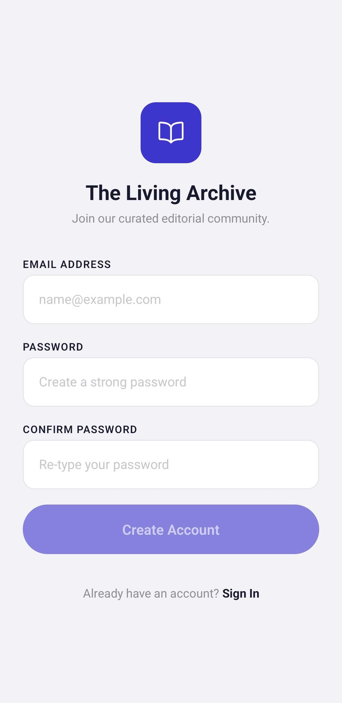
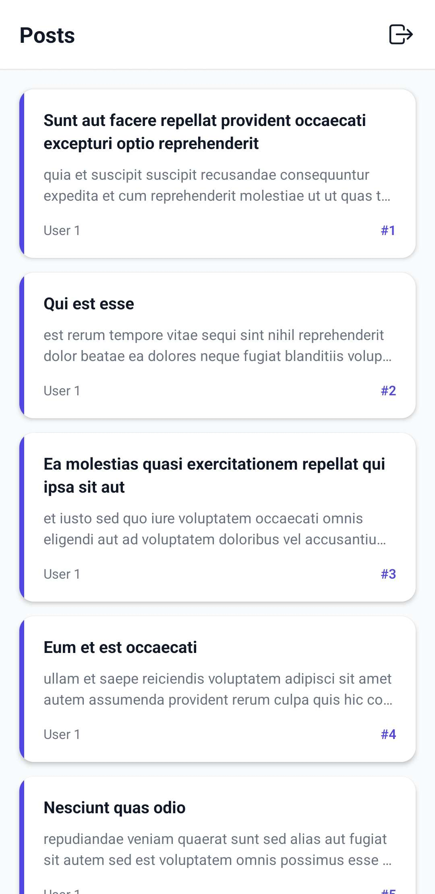
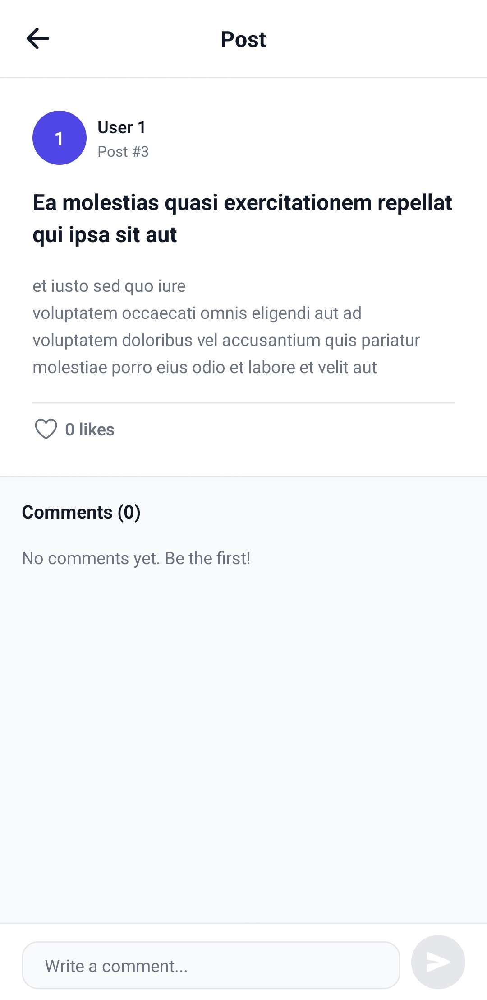
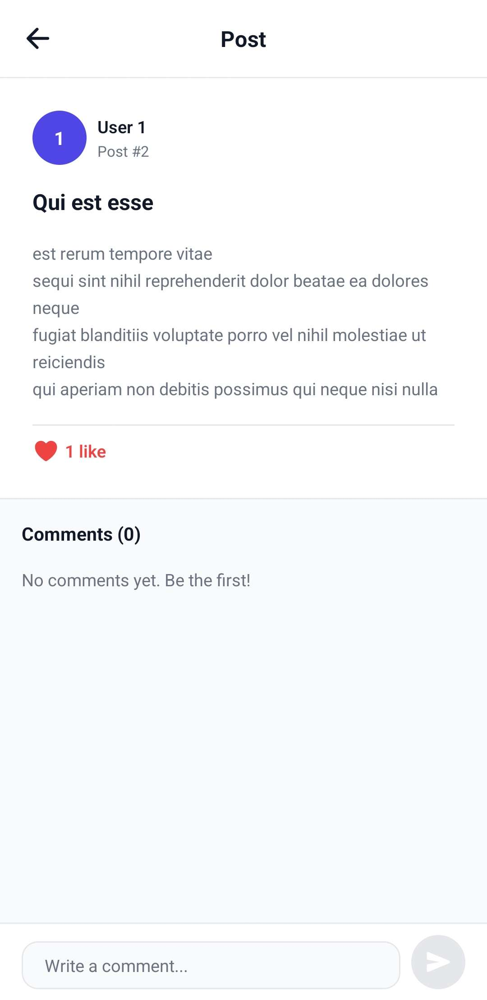
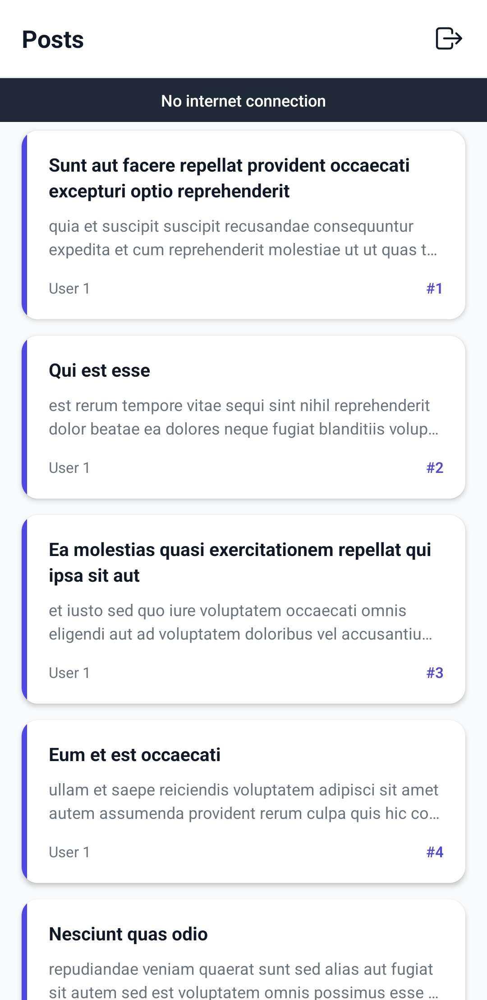

# Verso

Verso is a mobile app built with React Native and Expo. It lets users browse and read posts, like and comment on them, and sign in with email or Google. Data is fetched from the JSONPlaceholder API and social interactions (likes, comments) are stored in real time via Firebase Firestore.

[Download APK](https://github.com/Abid101e/VocaboApp/releases/tag/v.1)

---

## Screenshots

<!-- Add screenshots to the /screenshots folder and update the paths below -->

| Login | Register | Post List |
|-------|----------|-----------|
|  |  |  |

| Post Detail | Liked | Offline |
|-------------|-------|---------|
|  |  |  |

---

## Features

- Sign in with email and password or Google
- Browse a paginated list of posts
- View full post details with real-time likes and comments
- Like a post with optimistic UI — updates instantly, rolls back if it fails
- Leave comments that appear in real time across sessions
- Cached API responses — previously loaded pages load instantly offline
- Offline banner when there is no internet connection

---

## Tech Stack

- React Native 0.83 + Expo SDK 55
- TypeScript
- Firebase Auth + Firestore
- React Navigation
- AsyncStorage

---

## Project Structure

```
src/
├── features/
│   ├── auth/
│   │   ├── context/
│   │   │   └── AuthContext.tsx       # Auth state, Google Sign-In, login/register/logout
│   │   ├── hooks/
│   │   │   └── useAuth.ts            # Consumes AuthContext
│   │   ├── screens/
│   │   │   ├── LoginScreen.tsx
│   │   │   └── RegisterScreen.tsx
│   │   └── services/
│   │       └── authService.ts        # Wraps Firebase Auth, maps error codes
│   └── posts/
│       ├── components/
│       │   └── PostCard.tsx
│       ├── hooks/
│       │   ├── usePosts.ts           # Pagination, caching, load more
│       │   └── usePostDetail.ts      # Post fetch + Firestore likes/comments
│       ├── screens/
│       │   ├── PostListScreen.tsx
│       │   └── PostDetailScreen.tsx
│       └── services/
│           └── postService.ts        # Firestore likes and comments
├── components/
│   ├── Button.tsx
│   ├── ErrorBoundary.tsx
│   └── Input.tsx
├── hooks/
│   ├── useFetch.ts
│   └── useNetwork.ts
├── navigation/
│   ├── AppNavigator.tsx
│   └── AuthNavigator.tsx
├── services/
│   ├── api.ts                        # JSONPlaceholder fetch with caching
│   ├── cache.ts                      # AsyncStorage TTL cache
│   └── firebase.ts                   # Firebase app init
├── types/
│   └── index.ts
└── constants/
    ├── config.ts
    └── theme.ts
```

Features are self-contained — each one owns its screens, components, hooks, and services. Screens only handle layout and user interaction. All state, data fetching, and business logic lives in hooks and services.

---

## Getting Started

### Prerequisites

- Node.js 18+
- Expo Go app on your phone or an Android/iOS emulator

### Environment Variables

Create a `.env.local` file in the root of the project:

```
EXPO_PUBLIC_FIREBASE_API_KEY=
EXPO_PUBLIC_FIREBASE_AUTH_DOMAIN=
EXPO_PUBLIC_FIREBASE_PROJECT_ID=
EXPO_PUBLIC_FIREBASE_STORAGE_BUCKET=
EXPO_PUBLIC_FIREBASE_MESSAGING_SENDER_ID=
EXPO_PUBLIC_FIREBASE_APP_ID=
EXPO_PUBLIC_GOOGLE_WEB_CLIENT_ID=
EXPO_PUBLIC_API_BASE_URL=https://jsonplaceholder.typicode.com
EXPO_PUBLIC_GOOGLE_REDIRECT_URI=https://auth.expo.io/@<your-expo-username>/<your-app-slug>
```

### Install and Run

```bash
npm install
npm start
```

Scan the QR code with Expo Go or press `a` to open on an Android emulator.

### Build APK

```bash
npm install -g eas-cli
eas login
eas build -p android --profile preview
```

---

## AI Usage

- Used Google Stitch to generate the initial screen designs and UI layout
- Used ChatGPT to explore architecture ideas and decide on the folder structure before writing any code
- Used Claude Code mostly in ask mode to investigate bugs and issues — understanding the problem first before applying any fix
- Every AI-suggested change was reviewed and validated manually before being accepted
- UI was largely AI-assisted since it was not the focus; the priority was architecture and code quality
- All backend logic — Firestore services, auth service, caching, hooks — was mostly written by hand

---

## Git Workflow

Each feature was developed in its own branch and merged into `main` via a pull request. Fix branches were used for bug fixes after initial integration.

**Branch naming convention:**
- `feature/` — new screens or functionality
- `Fix/` — bug fixes
- `update/` — improvements to existing features

**Branch history:**

| Branch | Description |
|--------|-------------|
| `feature/auth` | Firebase auth setup, shared components (Button, Input), theme constants |
| `feature/auth-ui` | Login and Register screens |
| `feature/post-ui` | Post list screen UI |
| `feature/post-backend` | API integration, pagination, caching |
| `feature/post-detail` | Post detail screen with Firestore likes and comments |
| `update/errorboundary` | Error boundary for render crash safety |
| `Fix/ui-error-handle` | UI and error message improvements |
| `Fix/google-auth-issue` | Google Sign-In redirect URI fix |
| `feature/offilnesupport` | Offline detection and banner |
| `Fix/app-preview-build` | App icon, name, and build config |
